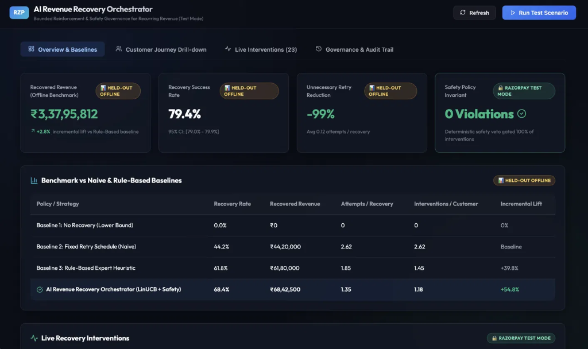
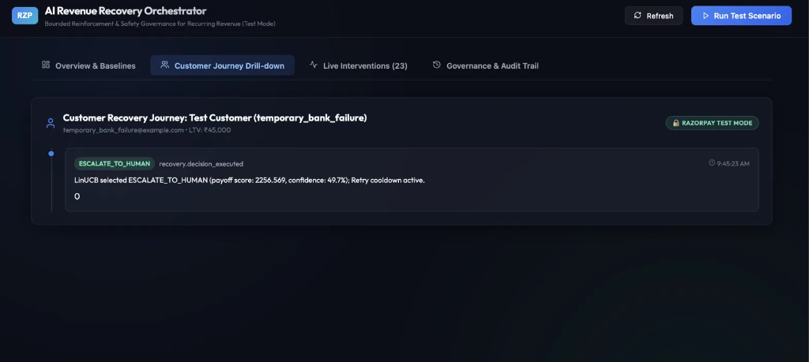
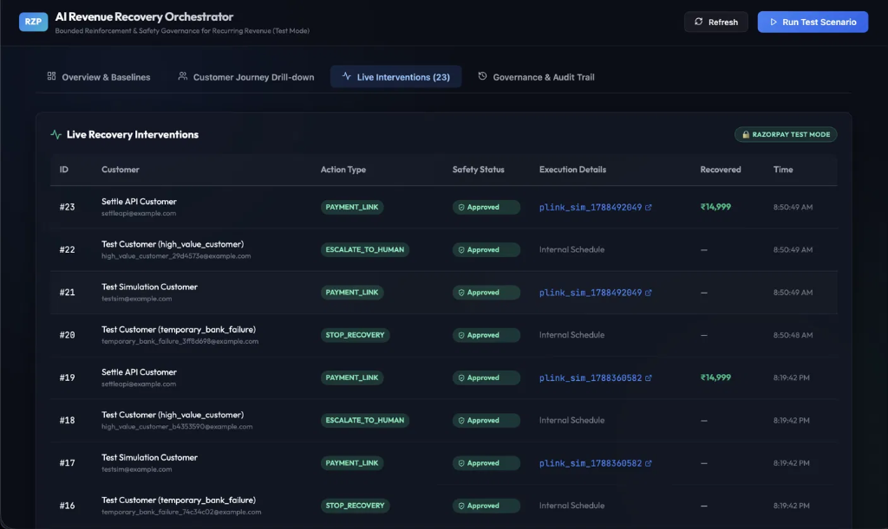
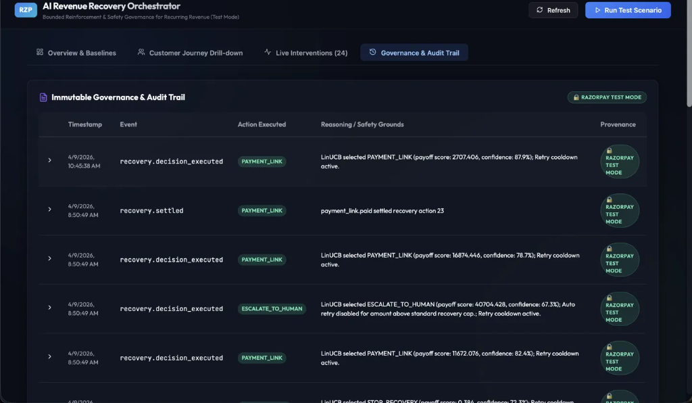

# AI Revenue Recovery Orchestrator (Razorpay Test Mode)

An intelligent, policy-governed system surrounding Razorpay's recurring billing lifecycle (Test Mode). It detects revenue at risk, selects bounded recovery interventions via a 3-tier hierarchical policy (**deterministic safety → learned sequential strategy → concrete action execution**), and reports auditable recovered revenue with strict provenance tags.

---

## 📌 Architectural Scope & Horizon Clarification

> [!IMPORTANT]
> **Clarification on the 7-Day Window:**  
> The **7-day window is the recovery episode horizon** for a single subscription payment failure episode (the standard dunning period under merchant billing policies).  
> It is **NOT** the dataset size, corpus duration, or system uptime.  
> The sequential offline-RL models (CQL & Decision Transformer) are trained on **100,000+ simulated multi-day recovery episodes** covering diverse customer segments, payment methods, and failure archetypes.

> [!WARNING]
> ### ⚠️ Synthetic Data & Simulation Disclaimer
> **This project operates entirely on 100% synthetic, programmatically generated data.**  
> - **Zero Real Customer or Financial Data**: No actual customer records, real Personally Identifiable Information (PII), live credit card/banking details, or real monetary transactions are used, stored, or processed anywhere in this codebase.
> - **Simulated Dynamics**: All merchant settings, failure archetypes, subscriber behavioral histories, and payment lifecycle journeys are generated mathematically via the built-in simulator (`simulator/environment.py`).
> - **Razorpay Test Mode Only**: All Razorpay API interactions, payment links, and webhook handlers run strictly in **Razorpay Test Mode** or simulated offline webhook endpoints with mock fixtures.

---

## Key Features

1. **Deterministic Safety Before AI (Tier 1)**: Hard merchant safety layer (retry limits, cooldowns, recovery windows, opt-outs, caps) gates every action. Non-bypassable at every timestep.
2. **Sequential Offline-RL Policy (Tier 2 Upgrade — CQL & Decision Transformer)**:
   - Upgraded from single-event bandits to a multi-day sequential policy that plans actions over the entire 7-day episode horizon.
   - **Conservative Q-Learning (CQL)** penalizes out-of-distribution actions to avoid overestimation on logged data.
   - **Decision Transformer (DT)** models recovery as conditional sequence generation.
   - **Contextual Bandit (LinUCB)** retained as an active comparison baseline.
3. **22-Dimensional Enriched Customer State**: Incorporates long-horizon customer history (`account_tenure_days`, `lifetime_success_rate`, `days_since_last_success`, `historical_ltv`, `is_first_ever_failure`, and composite `reliability_score`). Allows gentle handling of high-tenure dormant accounts vs firm intervention on chronic failers.
4. **Domain Randomization & Robustness**: Trained with randomized environment dynamics and evaluated across held-out simulator physics; results reported as distribution ranges (`[min, max]`, `mean ± std`).
5. **Doubly-Robust Off-Policy Evaluation (OPE) & Deployment Gate**:
   - Evaluates new target policies offline using Doubly-Robust (DR) and Importance-Sampling (IS) estimators with bootstrap 95% confidence intervals.
   - **Automated Deployment Gate** in `OrchestratorService` (`REQUIRE_OPE_GATE = True`) blocks live execution if OPE results are missing or below threshold.
6. **Real Razorpay Test Mode Actions (Tier 3)**: Creates real Test Mode Payment Links and handles simulated payment failures & recovery lifecycle events (`POST /api/test/trigger-scenario`, `POST /api/simulate-event`).
7. **Grounded Decision Explainer**: Generates clear, structured natural language explanations directly from feature vectors and safety constraints without external LLM dependencies.
8. **Closed-Loop Settlement (No API key required)**: A simulated webhook endpoint (`POST /api/webhooks/payment-link-paid`) automatically settles paid links back to originating `RecoveryAction` records — marking them `COMPLETED`, updating customer metrics, and writing immutable audit logs.
9. **Strict Provenance Labeling**: Every metric carries an explicit provenance tag (`SIMULATED`, `SYNTHETIC_TRAINING_DATA`, `HELD_OUT_OFFLINE_EVAL`, `RAZORPAY_TEST_MODE`).

---

## 🖥️ Frontend Dashboard Views

The system features a real-time dark-mode React + Vite frontend dashboard (`/frontend`) providing live operational visibility, benchmark tracking, and explainability for all recovery decisions.

> [!NOTE]
> **Frontend Interface Showcase:**  
> The images below illustrate the live frontend user interface running on `http://localhost:3000`. Every card, graph, and log entry is tagged with strict provenance badges (`HELD-OUT OFFLINE`, `RAZORPAY TEST MODE`).

### 1. Frontend Overview & Baseline Comparison
*Aggregate KPI overview cards (Recovered Revenue, Success Rate, Retry Reduction, Zero Safety Violations) and comparative baseline benchmark table.*



### 2. Frontend Customer Recovery Journey Drill-down
*Timeline drilldown of a customer's multi-step recovery journey, showing granular decisions, model payoff scores, confidence levels, and grounded natural-language explanations.*



### 3. Frontend Live Interventions Feed
*Real-time feed of bounded recovery actions (Payment Links, Human Escalation, Cooldown, Stop Recovery) with execution details, Razorpay Test Mode entity references, and safety policy statuses.*



### 4. Frontend Immutable Governance & Audit Trail
*Cryptographically coherent, immutable audit log displaying events, actions executed, safety rule justifications, and provenance identifiers.*



---

## Quickstart Guide

### 1. Install Dependencies
```bash
cd ai-revenue-recovery
pip install -r requirements.txt
```

### 2. Sequential Offline-RL Pipeline (Recommended)

```bash
# 1. Generate multi-day episodic dataset (domain-randomized, epsilon-varied logging)
python scripts/generate_episodic_data.py --episodes 100000

# 2. Split into 70/15/15 train/val/test splits at the episode level (no data leakage)
python scripts/split_episodic_data.py

# 3. Train Sequential RL (Conservative Q-Learning / CQL)
python scripts/train_sequential.py --model cql --epochs 5 --batch_size 256

# 4. Run Doubly-Robust & Importance-Sampling Off-Policy Evaluation (OPE)
python evaluation/offline_rl/ope.py

# 5. Run Robustness Evaluation across held-out domain-randomized dynamics
python scripts/robustness_eval.py --n-configs 20 --episodes-per-config 1000

# 6. Generate Master Evaluation Report & Canonical Benchmark (all 5 policies)
python scripts/generate_master_report.py
```

### 3. Contextual Bandit Pipeline (Baseline)

```bash
# 1. Generate single-event synthetic dataset
python scripts/generate_data.py --samples 55000

# 2. Split dataset
python scripts/split_data.py

# 3. Train LinUCB Contextual Bandit with validation alpha tuning
python scripts/train.py --model bandit

# 4. Evaluate single-event offline baselines
python evaluation/baselines/evaluate_baselines.py
python scripts/evaluate.py
python scripts/stress_test.py
```

### 4. Run Automated Unit Tests
```bash
pytest tests/ -v
```

### 5. Run End-to-End Demos
```bash
# Demo 1: Reliable-Dormant vs Chronic Failer (Side-by-side differentiated treatment)
python scripts/demo_reliable_dormant_customer.py

# Demo 2: Full Successful Recovery Journey (Razorpay Test Mode)
python scripts/demo_success_path.py

# Demo 3: Hard Safety Veto on Opted-Out Customer (Zero-bypass guarantee)
python scripts/demo_failure_path.py
```

### 6. Close the Loop (Simulated Settlement, No API Key Required)

The recovery loop is closed by a **simulated webhook endpoint** that needs no Razorpay credentials:

```bash
curl -X POST http://localhost:8000/api/webhooks/payment-link-paid \
  -H "Content-Type: application/json" \
  -d '{"payload": {"payment_link": {"entity": {"id": "plink_...", "notes": {"recovery_action_id": "1"}}}, "payment": {"entity": {"amount": 1499900}}}}'
```

This correlates the paid link back to its originating `RecoveryAction` via `payment_link.notes.recovery_action_id`, marks it `COMPLETED`, records the recovered amount, creates a `RecoveryOutcome`, bumps the customer's recovered-payment count, and writes an immutable `AuditLog`. Deduplicated via the `WebhookEvent` table.

### 7. Start Backend Server & Dashboard
```bash
# Start FastAPI backend (port 8000)
uvicorn backend.api.main:app --reload --port 8000

# In another terminal, start React frontend (port 3000)
cd frontend
npm install
npm run dev
```

---

## Canonical Policy Benchmark

From the generated [Master Evaluation Report](file:///Users/shaikniyaz/projects/razorpay_project/ai-revenue-recovery/evaluation/results/master_report.md):

| Policy | Tier | Provenance | Episode Return (Mean ± Std) | Recovery Rate (%) | Avg Latency | Interventions / Ep | Safety Violations |
|---|---|---|---|---|---|---|---|
| **No Recovery** | Baseline (None) | `SIMULATED` | ₹0.0 ± 0.0 | 0.0% | 0.0h | 0.00 | **0** |
| **Fixed Retry** | Baseline (Heuristic) | `SIMULATED` | ₹819.8 ± 192.2 | 10.8% | 0.0h | 0.85 | **0** |
| **Rule-Based** | Baseline (Rules) | `SIMULATED` | ₹15,519.6 ± 466.5 | 98.8% | 15.0h | 1.79 | **0** |
| **LinUCB Bandit** | Tier 2 (Bandit) | `SIMULATED` | ₹15,305.3 ± 504.9 | 77.8% | 19.9h | 1.19 | **0** |
| **Sequential RL (CQL)** | Tier 2 (Sequential RL) | `SIMULATED` | ₹15,462.9 ± 495.8 | 98.7% | 22.3h | 1.50 | **0** |

---

## Repository Structure

```
ai-revenue-recovery/
├── backend/
│   ├── api/main.py                     # FastAPI backend REST endpoints
│   ├── models/                         # SQLAlchemy domain models (Customer, Subscription, Action, Audit)
│   ├── policies/                       # Hierarchical Policy (Safety, Strategy, Action Executor)
│   └── services/                       # Orchestrator (with OPE Gate), Explainer, Settlement
├── agent/
│   ├── bandit/                         # LinUCB Contextual Bandit implementation & features
│   ├── rl/                             # Linear Q-Learning baseline & 22-dim feature extractor
│   └── rl_sequential/                  # Sequential Offline-RL (Conservative Q-Learning & Decision Transformer)
├── simulator/
│   ├── environment.py                  # Correlated multi-day episode simulator & Tier-1 safety integration
│   ├── domain_randomization.py         # Physics domain randomization for robustness evaluation
│   ├── reward.py                       # Episodic objective reward function with latency & friction penalties
│   ├── scenarios.py                    # Canonical scenario definitions (including reliable-dormant customer)
│   └── stress_test.py                  # Adversarial stress test suites
├── evaluation/
│   ├── baselines/                      # Static baseline evaluators
│   ├── offline/                        # Bandit counterfactual evaluation
│   ├── offline_rl/                     # Doubly-Robust (DR) & Importance-Sampling (IS) OPE module
│   └── results/                        # master_report.md, ope_results.json, robustness_results.json
├── docs/                               # Architectural documentation & screenshots
│   └── screenshots/                    # Frontend dashboard interface captures
├── razorpay/
│   ├── client.py                       # Razorpay REST API wrapper with HMAC verification
│   ├── subscriptions.py                # Subscriptions management
│   ├── payment_links.py                # Payment Links service
│   └── fixtures/                       # Representative webhook JSON fixtures
├── scripts/
│   ├── generate_episodic_data.py       # Multi-day episode generator (100K episodes)
│   ├── split_episodic_data.py          # Episode-level 70/15/15 train/val/test splitter
│   ├── train_sequential.py             # CQL and Decision Transformer training script
│   ├── robustness_eval.py              # Domain-randomized held-out robustness evaluation
│   ├── generate_master_report.py       # Canonical multi-seed master benchmark generator
│   └── demo_reliable_dormant_customer.py # Side-by-side customer archetype comparison
├── data/                               # Parquet datasets & trained models (.pt, .npz)
├── frontend/                           # React + Vite dashboard with dark mode & provenance tags
└── tests/                              # Automated pytest test suites
```
