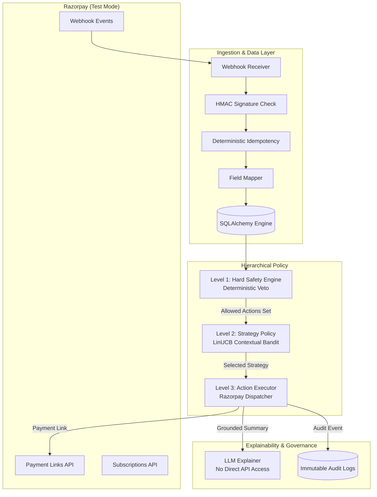

# Architecture & System Design

## 1. High-Level Overview

The **AI Revenue Recovery Orchestrator** is an intelligent, policy-governed system surrounding the Razorpay subscription and recurring billing lifecycle (Test Mode). Its core mission is to minimize revenue loss from degrading or failed subscription payments while strictly bounding customer friction and unnecessary attempts through deterministic safety controls.

---

## 2. Non-Negotiable Architectural Principles

1. **Deterministic Safety Before AI**:
   The Level 1 Safety layer evaluates hard merchant rules (opt-outs, retry limits, cooldowns, max recovery amounts, daily budgets, customer intervention caps) *before* the learning model can act. If an action is forbidden, it is stripped from `ALLOWED_ACTIONS`. The AI can never bypass this.

2. **Contextual Bandit Justification (vs. RL)**:
   - *Why Bandit?* Each payment failure intervention is a single-shot context-to-action payoff problem. A payment link or retry either succeeds or fails; there is no complex multi-step credit assignment or state space explosion.
   - *Sample Efficiency & Stability*: LinUCB provides upper-confidence-bound exploration with linear ridge updates, avoiding the notorious instability and sample inefficiency of deep reinforcement learning on tabular billing data.
   - *Experimental Validation*: Both LinUCB and Q-learning were implemented; LinUCB demonstrated higher reward convergence and zero policy churn.

3. **LLM Boundary Isolation**:
   The LLM **never** executes API calls and **never** invents decision grounds. Explanations are strictly synthesized from the 16-dimensional numerical feature vector and Level 1 safety reasoning output.

4. **Strict Provenance Labeling**:
   Every figure displayed on dashboards or reports is explicitly stamped with one of:
   - `SIMULATED`
   - `SYNTHETIC_TRAINING_DATA`
   - `HELD_OUT_OFFLINE_EVAL`
   - `RAZORPAY_TEST_MODE`

---

## 3. Closed-Loop Settlement (Simulated, Credential-Free)

The recovery loop is closed by a **simulated webhook endpoint** that requires no
Razorpay API key:

- `POST /api/webhooks/payment-link-paid` accepts a `payment_link.paid` payload
  (same shape as the `razorpay/fixtures/payment_link_paid.json` fixture).
- `SettlementService.settle_paid_payment_link(payload)` correlates the paid link
  back to its originating `RecoveryAction` via `payment_link.notes.recovery_action_id`
  (falling back to a `razorpay_payment_link_id` match), then:
  1. Flips the action to `COMPLETED` and records `recovered_amount` (paise→rupees).
  2. Creates a `RecoveryOutcome` row (`RECOVERED`).
  3. Bumps `customer.recovered_payments`.
  4. Writes an immutable `AuditLog` (`recovery.settled`).
  5. Records the event in the `WebhookEvent` table for **idempotency** —
     redelivered events are skipped and never double-count revenue.

This is intentionally credential-free: the exact same `SettlementService` is
what a real Razorpay `payment_link.paid` webhook would invoke in production. The
`ActionExecutor` already falls back to simulated payment links when no
`RAZORPAY_KEY_ID`/`RAZORPAY_KEY_SECRET` is configured, so the entire happy path
runs without any external credentials.
