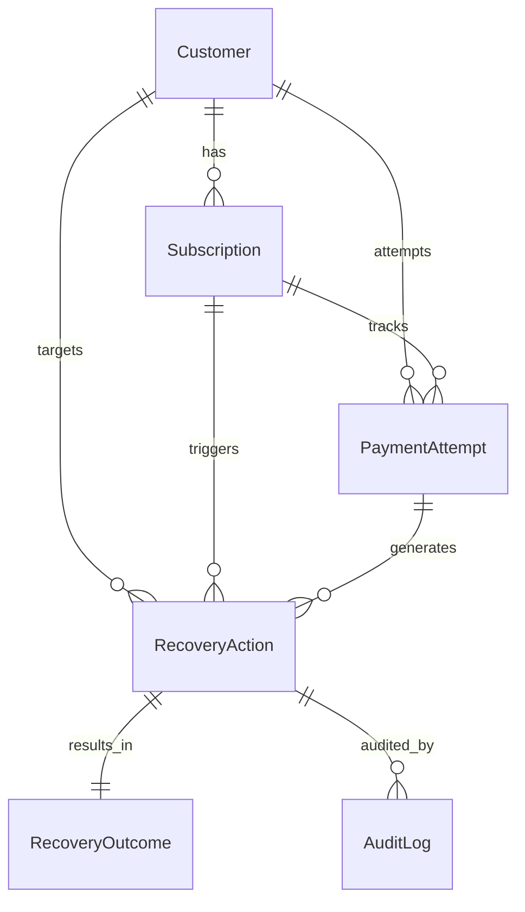

# Internal Data Model & Razorpay Schema Mapping

We intentionally **do not** mirror Razorpay's internal database tables. Instead, incoming webhook payloads are parsed, verified, and mapped into our domain-driven schema at ingestion time.

## 1. Domain Entity Relationship

---

## 2. Razorpay to Internal Field Mapping Table

| Razorpay Webhook Entity & Field | Internal Domain Model & Field | Transformation / Logic |
|---|---|---|
| `subscription.id` | `Subscription.razorpay_subscription_id` | Direct String Index |
| `subscription.status` | `Subscription.status` | Enum mapping (`pending` / `halted`) |
| `subscription.paid_count` | `Subscription.paid_count` | Integer |
| `subscription.current_start` | `Subscription.current_period_start` | Epoch timestamp → `datetime` |
| `payment.id` | `PaymentAttempt.razorpay_payment_id` | Direct String Index |
| `payment.amount` | `PaymentAttempt.amount` | Paise → Rupees (`amount / 100.0`) |
| `payment.error_reason` | `PaymentAttempt.failure_reason` | Classified into internal `FailureReason` |
| `payment.method` | `PaymentAttempt.payment_method` | String (`card`, `upi`, `netbanking`) |
| `payment_link.id` | `RecoveryAction.razorpay_payment_link_id` | Recovery link correlation |
| `payment_link.notes.recovery_action_id` | `RecoveryOutcome.recovery_action_id` | Correlates settlement to intervention |
